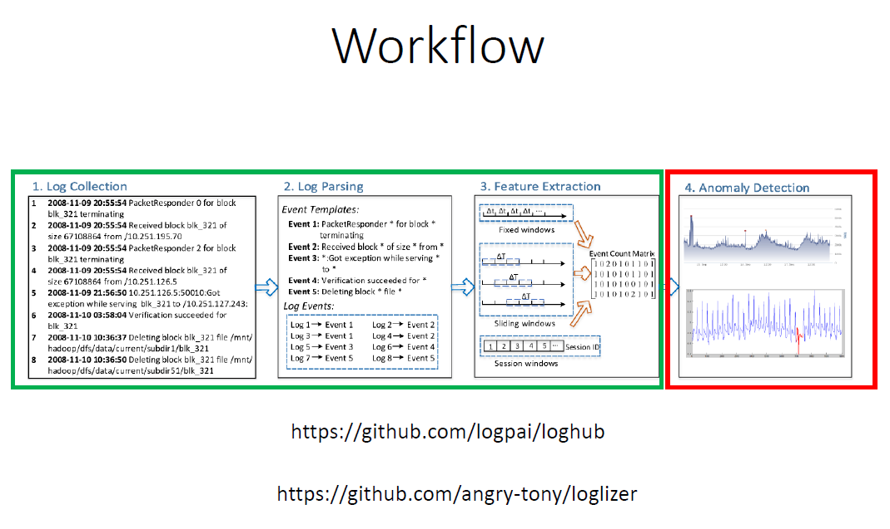

# 586-LogProblemProject
 Just a log problem project.

### Problem Statement
Given a labelled system log file and/or sensor data develop a feature extraction module for anomaly detection and then train the ML model (not necessarily deep learning).

### Features to Extract from time x event based data
- Use windows to render time data discrete
- Sliding window for event type combinations
- Sliding window for total event counts
- Static windows for event type combinations
- Static windows for total event counts
- 

### EDA
- check for event covariances (log events are most certainly not independent in many cases)
- If strong covariances exist, consider grouping these into a single variable
- One hot encoding all 14 variables

### Questions for Apurva
- Is the dataset considered unlabeled since we don't know what combinations of events are considered anomalies? 
- Are our anomaly detection programs going to use active learning for streaming/realtime data or is it more to act as a proof of concept for data that's alread been collected? With cloud services like HDFS, it makes sense to actively seek out anomalies than to check after a certain period of time has passed.
- What method would you choose between PCA+MD (anomalies are labeled beyond a distance determined by a training set) or neural autoencoders (where anomalies are found when the generated vs input data has an error greater than a certain threshold determined by a training set)?

### Notes on choosing an algorithm
-Isolation Forest (in general and in large feature space of unknown quality)
- ABOD and LOF for highly clustered anomalies
- Isolation Forest and LODA scale well to large data sets while the other algorithms do not.
- TRINITY
- iForests and iNNE do extremely well!!!!!
- Distance-based detectors are robust (Kernel mahalanobis, kNN)
- Increased sample sizes however decrease the average distance to the nearest anomaly, so more data can worsent certain "gravity defiant" models (worsen with more data)
- N

### Deliverable
Hope is that each project will be an article that can be published.
- Resource: [How to read a research paper](http://blizzard.cs.uwaterloo.ca/keshav/home/Papers/data/07/paper-reading.pdf)
- Submission will be 3 items:
    - 8-10 page report (including references)
    - Python or R notebooks that can be used to replicate the results (preferably Python)
    - 3-5 min video that demos your technique

### Report Structure
- Abstract
- Intro (1/2 page)
- Lit review (1-2 pages)
- Methodology (2-3 pages)
- Experiment and Results (2-3 pages)
- References
- Format: [IEEE/ACM format](https://www.overleaf.com/latex/templates/acm-conference-proceedings-new-master-template/pnrfvrrdbfwt) or [this one](https://www.acm.org/binaries/content/assets/publications/word_style/interim-template-style/interim-layout.docx)
