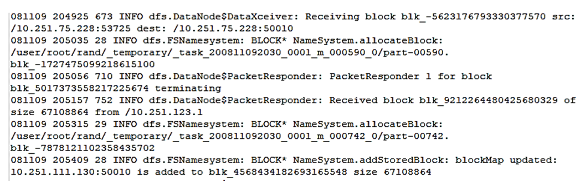
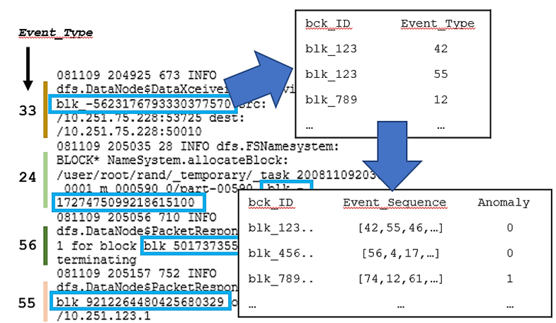
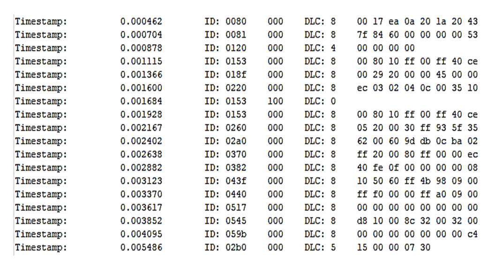
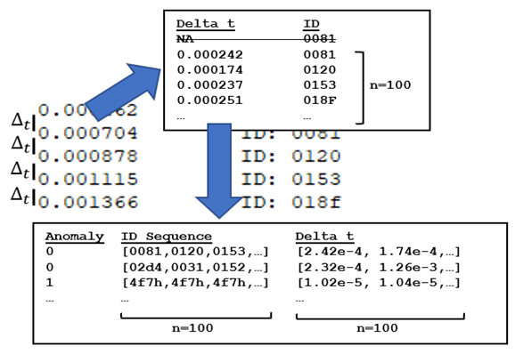

# A Log Anomaly Detection Project
 An initial exploration into anomaly detection on Hadoop distributed system and vehicle networking logs.

### Problem Statement
Given a labelled system log file and/or sensor data, develop a feature extraction module for anomaly detection.

### Feature Extraction Philosophy
- To find an reliable predictor of anomalies, we need a feature that defines anomalies in log systems.
- Log anomalies aren't log events themselves but block IDs that don't behave as expected. 
- For example, a block ID "received" a packet of information and the subsequent event states the block ID is "receiving". This is contradictory as blocks cannot be receiving information after having received the information, thus is anomalous.
- Our primary feature should then relate to the sequence of events that takes places in a block instance.

### Model Philosophy
- A recurrant neural network should perform well on sequential data (ie. event sequences). As such we'll try using LSTMs.
- [For more details and in depth discussion go here]()

---

**A Hadoop distributed system log screenshot:**

**An example of sequential feature extraction:**

---

**A car networking log example:**

**An example of a slightly adapted sequential feature extraction:**

